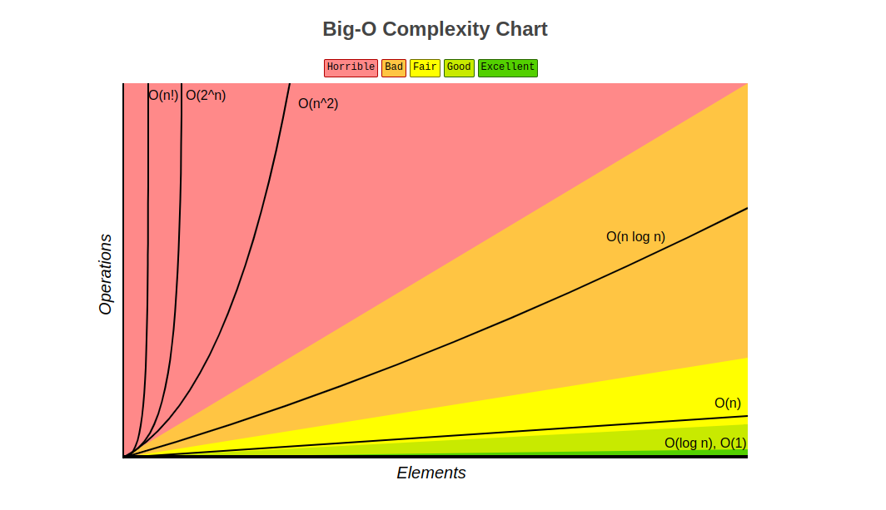

# Big O

Big O is a way to categorize algorithms based on how their runtime or space requirements grow as the inputs grow. Big O specifically doesn't care about precision, only general trends (e.g., `O(n^2 + n)` and `O(n^2)` are equivalent).

Big O of N (O(n))-> The algorithm will grow linearly based on input.

Some concepts to keep in mind:

- Growth is with respect to the input size
- Constants are dropped (e.g., `O(2n)` is `O(n)`)
- Worst case is usually the way to go (e.g., `O(n)` is `O(n^2)`)

---

Big O Complexity Chart

---

Big O Cheat Sheet

---
